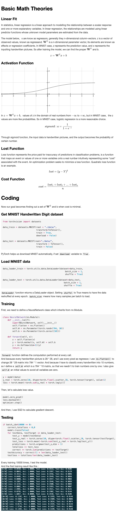
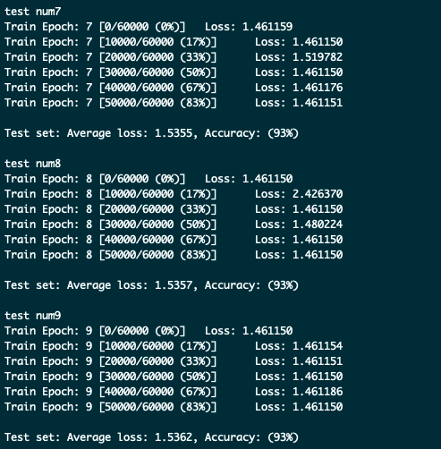

### Improvement

Previously I use SGD as optimizer, and use `torch.mean(-torch.sum(y_real * torch.log(y)))` as loss function. To improve the accuracy of my model, I change SGD into Adam and use CrossEntropyLoss as loss function.
```Python
model = NeuralNetwork()
# optimizer = optim.SGD(params=model.parameters(), lr=0.01)
optimizer = optim.Adam(params=model.parameters()) # Change grade desend function from SGD to Adam

def train(epoch):
    for batch_idx, (data, target) in enumerate(data_loader_train): 
        y = model(data)
        # y_real = torch.zeros(10, dtype=torch.float).scatter_(0, torch.tensor(target), value=1)
        # loss = torch.mean(-torch.sum(y_real * torch.log(y)))
        loss = nn.CrossEntropyLoss()(y.float(), target) # Use cross entrypy loss function to improve accuracy
        if batch_idx % 10000 == 0:
            print('Train Epoch: {} [{}/{} ({:.0f}%)]\tLoss: {:.6f}'.
                format(
                    epoch,
                    batch_idx * len(data),
                    len(data_loader_train.dataset),
                    100. * batch_idx / len(data_loader_train),
                    loss.item()))
        optimizer.zero_grad()
        loss.backward()
        optimizer.step()
```

The accuracy improve from 91% to 93%. Little improvement, but good result 🤣.
