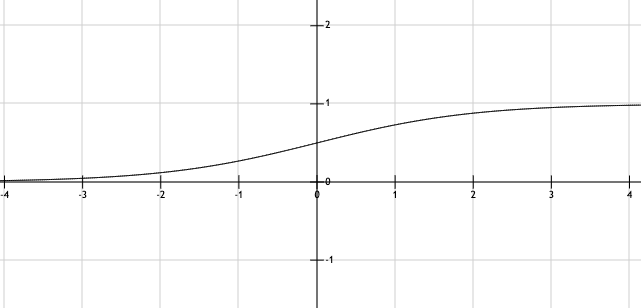
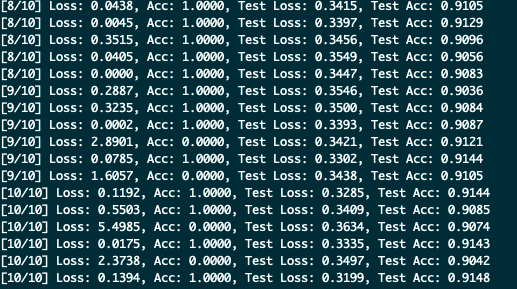

# Basic Math Theories

### Linear Fit
In statistics, linear regression is a linear approach to modelling the relationship between a scalar response and one or more explanatory variables. In linear regression, the relationships are modeled using linear predictor functions whose unknown model parameters are estimated from the data. 

The model below，x are know as regressors, generally they n-dimensional column-vectors. z is a vector of observed values, known as regressand. $\mathbf{W}^\mathrm{T}$ is a n-dimensional parameter vector, its elements are known as effects or regression coefficients. In MNIST case, z represents the prediction value, and x represents the inputting handwritten pictures. So after training the model, we can find the proper $\mathbf{W}^\mathrm{T}$ and b.$$z=\mathbf{W}^\mathrm{T}x+b$$

### Activation Function

In $z=\mathbf{W}^\mathrm{T}x+b$，values of z in the domain of real numbers from $-\infty$  to $+\infty$, but in MNIST case，the z values are more like probabilities. So in MNIST case, logistic regression is a more reasonable choice. 
$$sigmoid: a=\frac{1}{1+e^{-z}}$$
Through sigmoid function, the input data is handwritten pictures, and the output becomes the probability of certain number.

### Lost Function
 Loss function represents the price paid for inaccuracy of predictions in classification problems, is a function that maps an event or values of one or more variables onto a real number intuitively representing some "cost" associated with the event. An optimization problem seeks to minimize a loss function. Quadratic loss function is an example.$$lost=(y-Y)^2$$
### Cost Function
$$cost=\frac{lost_1+lost_2+...+lost_n}{n}$$

# Coding
Now our goal becomes finding out a set of $\mathbf{W}^\mathrm{T}$ and b when cost is minimal.
### Get MNIST Handwritten Digit dataset
```Python
from torchvision import datasets

data_train = datasets.MNIST(root = "./data/",
                            transform=ToTensor(),
                            train = True,
                            download = False)

data_test = datasets.MNIST(root="./data/",
                            transform = ToTensor(),
                            train = False)
```
PyTorch helps us download MNIST automatically, if set `download` variable to `True`.

### Load MNIST data
```Python
data_loader_train = torch.utils.data.DataLoader(dataset=data_train,
                                                    batch_size = 1,
                                                    shuffle = True)

data_loader_test = torch.utils.data.DataLoader(dataset=data_test,
                                                   batch_size = 1,
                                                   shuffle = True)
```
`DataLoader` function returns a DataLoader object. Setting `shuffel` to True means to have the data reshuffled at every epoch. `batch_size` means how many samples per batch to load.

### Training
First, we need to define a NeuralNetwork class which inherits from nn.Module.
```Python
class NeuralNetwork(nn.Module):
    def __init__(self):
        super(NeuralNetwork, self).__init__()
        self.flatten = nn.Flatten()
        self.W = nn.Parameter(torch.randn(784, 10))
        self.b = nn.Parameter(torch.zeros([10]))

    def forward(self, x):
        x = self.flatten(x)
        y = torch.matmul(x, self.W) + self.b
        y = nn.Softmax(dim=1)(y)
        return y
```
`forward` function defines the computation performed at every call.
And because every handwritten picture is 28 * 28, and I use every pixel as regressor, I use `nn.Flatten()` to change 28 * 28 matrix into 784 * 1 vector. And because I have to classify every handwritten into 10 numbers, so I define a `self.W` which is a 784 * 10 matrix, so that we needn't to train numbers one by one. I also give `self.W` an initial values to avoid all variables are zero.

```Python
y = model(data)
y_real = torch.zeros(10, dtype=torch.float).scatter_(0, torch.tensor(target), value=1)
loss = torch.mean(-torch.sum(y_real * torch.log(y)))
```
Then, let's calculate loss value.

```Python
model.zero_grad()
loss.backward()
optimizer.step()
```
And then, I use SGD to calculate gradient descent.

### Testing
```Python
if batch_idx%10000 == 0:
    correct,totalloss = 0,0
    model.train(False)
    for testData, testTarget in data_loader_test:
        test_y = model(testData)
        test_y_real = torch.zeros(10, dtype=torch.float).scatter_(0, torch.tensor(testTarget), value=1)
        test_loss = torch.mean(-torch.sum(test_y_real * torch.log(test_y)))
        predictions = torch.argmax(test_y,dim = 1)
        totalloss += test_loss
        correct += torch.sum(predictions == testTarget)
    testAccuracy = correct/(1 * len(data_loader_test))
    testloss = totalloss/len(data_loader_test)
```
Every training 10000 times, I test the model.
And the first training result like this :
