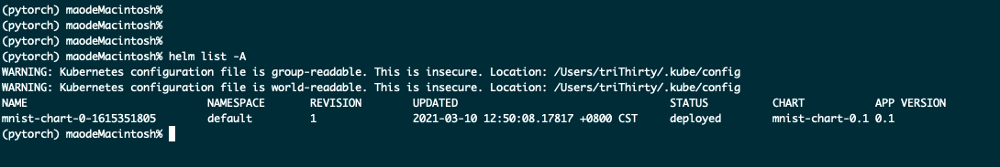
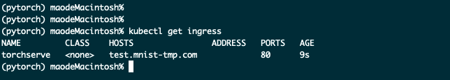
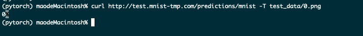

# Run the MNIST model on TorchServe and Deploy the Server on Kubernetes

### Output the trained model
Run `Python3 ../head_first_ml/mnist.py`, the output is `mnist_ccn.pt`

### Write a handler for TorchServe
```Python
# mnist_handler.py

from torchvision import transforms
from ts.torch_handler.image_classifier import ImageClassifier
import torch


class MNISTDigitClassifier(ImageClassifier):
    """
    MNISTDigitClassifier handler class. This handler extends class ImageClassifier from image_classifier.py, a
    default handler. This handler takes an image and returns the number in that image.
    Here method postprocess() has been overridden while others are reused from parent class.
    """

    image_processing = transforms.Compose([
        transforms.ToTensor(),
        transforms.Normalize((0.1307,), (0.3081,))
    ])

    def postprocess(self, data):
        """The post process of MNIST converts the predicted output response to a label.
        Args:
            data (list): The predicted output from the Inference with probabilities is passed
            to the post-process function
        Returns:
            list : A list of dictionary with predictons and explanations are returned.
        """
        return data.argmax(1).tolist()
```

### Create a new model architecture file which contains model class extended from torch.nn.modules

```Python
#mnist.py

import torch
from torch import nn

class NeuralNetwork(nn.Module):
    def __init__(self):
        super(NeuralNetwork, self).__init__()
        self.flatten = nn.Flatten()
        self.W = nn.Parameter(torch.randn(784, 10))
        self.b = nn.Parameter(torch.zeros([10]))

    def forward(self, x):
        x = self.flatten(x)
        y = torch.matmul(x, self.W) + self.b
        # Applies the Softmax function to an n-dimensional 
        # input Tensor rescaling them so that the elements 
        # of the n-dimensional output Tensor lie in the range 
        # [0,1] and sum to 1.
        y = nn.Softmax(dim=1)(y)
        return y
```

### Write Dockerfile to build custome image
```Dockerfile
FROM pytorch/torchserve:0.3.0-cpu

ADD mnist_cnn.pt /tmp/
ADD mnist_handler.py /tmp/
ADD mnist.py /tmp/

RUN torch-model-archiver --model-name mnist --version 1.0 --model-file /tmp/mnist.py --serialized-file /tmp/mnist_cnn.pt --handler /tmp/mnist_handler.py && \
     mkdir -p /tmp/models && \
     mv mnist.mar /tmp/models

CMD ["torchserve", "--start", "--model-store", "/tmp/models", "--models", "mnist=mnist.mar"]
```
Two things had be done in Dockerfile.
- One is to use torch-model-archiver to generate mnist.mar.
- Two is to set CMD to run torchserve.

Then run `docker build -t mnist:v0.1.0 .`, we get a TorchServe image where mnist model runs.

### Generate Helm chart
For mnist TorchServe, I use ingress to export the inner service which includes 8080 and 8081 port. For 8080, it's use as REST based inference. For 8081, it's use as metrics APIs which can be used by Promethues.

Then we run `helm lint mnist_chart` to check the syntax.

Use `helm package mnist_chart` to pack our chart, it will generate mnist-chart-0.1.tgz on current directory.

Use `helm install mnist-chart-0.1.tgz --generate-name` to deploy a release on current kubernetes cluster.



### Test
In helm chart, I use the host name `test.mnist.com`, so first we need change the hosts file, make `test.mnist.com` can be resolve to our ingress IP.



In test_data directory, I put the test data which is handwritten number zero.

Use `curl http://test.mnist-tmp.com/predictions/mnist -T test_data/0.png`

We get `0` as response.

